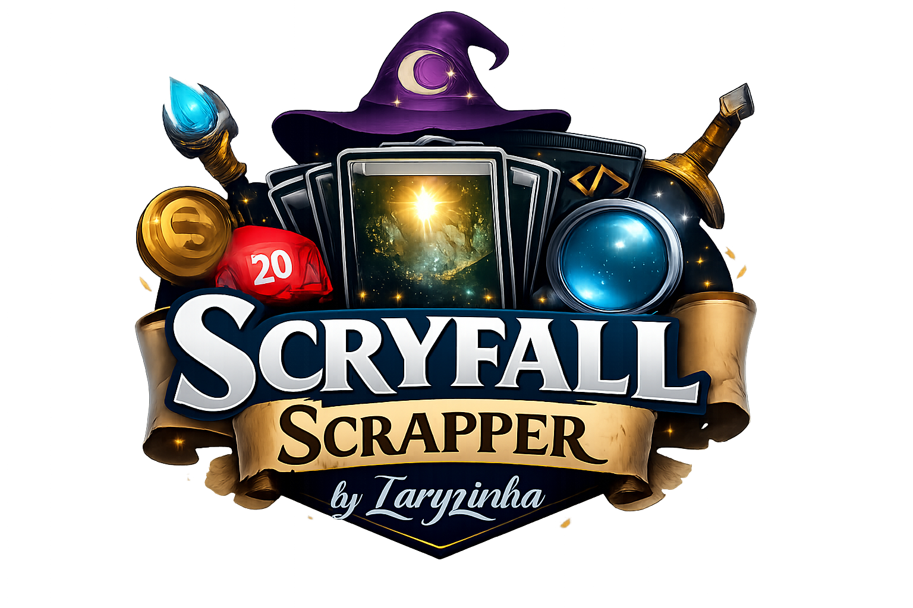
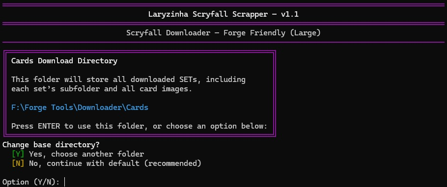
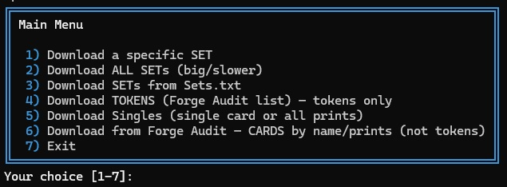

<p align="center">
  
</p>

<p align="center">
  <strong style="font-size: 2.3em;">Scryfall Scrapper</strong>
</p>


<p align="center">
Forge-friendly Scryfall image downloader for Magic: The Gathering
<p>

<p align="center">
Designed to handle real-world Forge naming issues, special layouts and audit-based workflows.
</p>

<br/>

---

<br/>

## 💜 Overview

Scryfall Scrapper is a command-line tool designed to download high-quality card
and token images from Scryfall in a way that is compatible with Forge’s naming
and layout expectations.

It focuses on real-world Forge use cases, including special card layouts,
multiple print variants, Secret Lair products, and audit-based workflows,
avoiding silent overwrites and unexpected file mismatches.

## 📸 Screenshots
Below are real screenshots from the interactive CLI, showing the main workflows.

### 🚀 Startup
Initial setup and base directory selection.


### 🧭 Main menu
Interactive CLI menu providing access to all download modes.


### 📊 Download progress
Real-time progress bar with speed, ETA and card count.


### ✅ Completion summary
Detailed summary after completion, including counts and performance.


---

## ✨ Features

- Download full sets from Scryfall
- Download single cards and all available prints
- Token downloader using Forge `Audit.txt`
- Audit-based card image downloader (non-token cards)
- Handles split, flip, adventure and double-faced cards
- Colored CLI interface with progress bars

---

## 🛣️ Roadmap

Planned improvements include internal refactors, modularization, and tools to
help detect and resolve Forge image naming inconsistencies.
See [`ROADMAP.md`](ROADMAP.md) for details.
Community feedback is welcome.

---

## ⚙️ Requirements

- Python 3.8 or higher
- Dependencies listed in `requirements.txt`

---

## 🌱 Getting started (first run)

If you're new to Python or GitHub, follow the step-by-step beginner guide:

➡️ **[GETTING_STARTED.md](GETTING_STARTED.md)**

---

## 📦 Installation

Clone the repository and install dependencies:

```bash
git clone https://github.com/laryzinha/forge-scryfall-scrapper.git
cd forge-scryfall-scrapper
pip install -r requirements.txt
```

---

## ▶️ Usage

Run the main entry point:

```bash
python src/Downloader.py
```

Follow the interactive on-screen menu to download:

* Complete sets
* Individual cards or prints
* Tokens via Forge Audit
* Cards via Forge Audit (non-token)

---

## ⚠️ Known issues and limitations

Forge image handling can be inconsistent depending on the card layout,
print variation and Forge snapshot version. While this tool attempts to
handle most real-world cases, some limitations remain.

Please note the following:

- Forge's **"Audit Card and Image Data"** feature may not report all missing
  images in every scenario. Depending on the card layout, naming or snapshot,
  some missing images may not be flagged.

- The same card artwork may exist under different names
  (oracle name, printed name, or flavor name). This can occasionally result in
  apparent duplicates or missing images when Forge resolves filenames
  differently than expected.

- Special layouts such as **split / aftermath**, **flip**, and
  **double-faced cards (DFC)** may generate multiple image files and/or require
  rotation. The downloader includes layout-aware handling, but edge cases may
  still require manual verification.

- Some Secret Lair (SLD) and special products use a printed card name that
  differs from the oracle name. In these cases, using the **SetOnly downloader**
  (printed-name–first logic) is recommended.

- When using audit-based downloads, some cards may remain unmatched due to
  naming discrepancies between Forge audit data and Scryfall metadata. These
  cases are intentionally logged and skipped rather than silently overwritten.

These behaviors reflect real limitations in how Forge references card images
and how naming varies across different products and layouts.

Also, these limitations are documented intentionally to avoid silent failures or unexpected overwrites.

---

## 📁 Output

All downloaded content (cards, tokens, audit files and logs) is stored locally and ignored by Git via `.gitignore`.

Typical folders created at runtime:

* `Cards/`
* `Singles/`
* `Tokens/`

---

## 🧩 Project Structure

```text
forge-scryfall-scrapper/
├─ src/
│  ├─ Downloader.py
│  ├─ Downloader_SetOnly.py
│  ├─ DToken.py
│  ├─ SingleCard.py
│  ├─ AuditDownloader.py
│  └─ __init__.py   (optional)
│
├─ .gitignore
├─ README.md
├─ requirements.txt
├─ LICENSE
└─ CHANGELOG.md
```

---

## 💭 About this project

This is a personal project developed to support local Forge installations with reliable,
Forge-friendly card and token image downloads.

Before starting this project, I explored many of the existing approaches available online:
manual downloads, bulk JSON files, large data dumps, and other scripts and tools.
While functional, none of them fully matched what I was looking for.

Most solutions felt unnecessarily complex, relied on massive JSON datasets,
or required manual steps that made maintenance and updates harder than they needed to be.
I wanted something simpler, more direct, and focused on the real-world way Forge handles
card images.

So this project started from a very practical need:
a tool that could download images cleanly, handle naming and layout quirks correctly,
and work without forcing users to deal with large datasets or fragile workflows.

Over time, it evolved organically — improving how cards are detected, renamed, rotated,
enumerated, and handled across different layouts and products.
As it kept proving useful for my own setup, I realized it might also help other Forge users.

> If it helps even one other person, that’s already enough. 💜

All card data and images are fetched dynamically and directly from the official
[Scryfall API](https://scryfall.com/docs/api).

This tool does **not** rely on Scryfall bulk JSON downloads and does **not** redistribute
any Scryfall data or assets. All downloaded content is stored locally on the user's machine
and excluded from version control via `.gitignore`.

---

## 🔐 Security & Transparency

This project is designed to be **fully transparent and local-only**.

- No telemetry
- No data upload
- No background execution
- Network access limited strictly to the official Scryfall API

👉 Please read **[SECURITY.md](SECURITY.md)** for a full technical breakdown.

---

🔍 **Open source & auditable**

Every line of code in this repository is readable and verifiable.  
If something looks wrong, it probably *is* wrong, open an issue (Please).

---

## 📜 License

This project is released under the MIT License.  
See the `LICENSE` file for details.

<p>This project downloads images from Scryfall for personal, non-commercial use.</p>
All card images are © Wizards of the Coast.

---

Designed to be safe, idempotent and Forge-compatible by default.

---

<p align="center">
─────────────── ✦ ───────────────
</p>

<p align="center">
  <em>Built with care for Forge and the MTG community</em><br/>
  <strong>Laryzinha</strong>
</p>

<p align="center">
─────────────── ✦ ───────────────
</p>